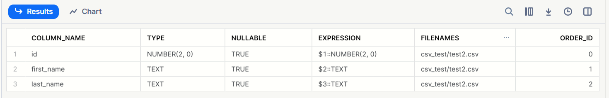
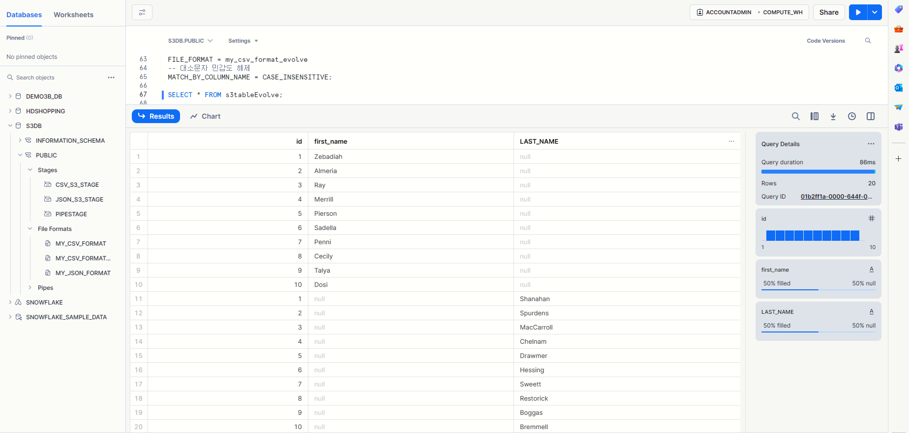
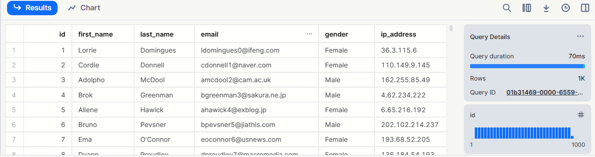

<!-- ## 1. 테이블 에볼루션, 스키마 디텍션 

- S3 데이터 변경 시, SN 테이블 변경
- S3 저장된 파일을 감지 

## 2. 하루 배치 벌크 업데이트 시, (생성 업데이트 삭제) -> 처리 고안

## 3. 실체화되 뷰, 다이나믹 테이블의 차이점. 정리  -->

---

# 1. INFER_SCHEMA

> 반정형 데이터가 포함된 일련의 스테이징된 데이터 파일에서 파일 메타데이터 스키마를 자동으로 감지하고, 열 정의를 검색합니다.

**<span style="background-color:yellow; color:red">쉽게 말해, <br> Stage내의 반정형 파일의 메타데이터(열{Column}정의, Header)를 읽고 열(Column)으로 변환하는 기술이다.</span>**

-> 언급되었던 **`SCHEMA DETECTION`** 의 역할
<br>
-> 이 함수는 Apache Parquet, Apache Avro, ORC, JSON 및 CSV 파일을 지원합니다.

```sql
INFER_SCHEMA(
  LOCATION => '{ internalStage | externalStage }'
  , FILE_FORMAT => '<file_format_name>'
  , FILES => '<file_name>' [ , '<file_name>' ] [ , ... ]
  , IGNORE_CASE => TRUE | FALSE
  , MAX_FILE_COUNT => <num>
  , MAX_RECORDS_PER_FILE => <num>
)

internalStage ::=
    @[<namespace>.]<int_stage_name>[/<path>][/<filename>]
  | @~[/<path>][/<filename>]

externalStage ::=
  @[<namespace>.]<ext_stage_name>[/<path>][/<filename>]
```

## Example

> **_지정한 External Stage에 CSV 데이터를 저장했다.<br>
그리고 Snowflake에서 해당 CSV를 저장할 수 있는 Table을 만들기 원하는 상황일 때,_**

```sql
SELECT *
  FROM TABLE(
    INFER_SCHEMA(
      LOCATION=>'@csv_s3_stage/'
      , FILE_FORMAT=>'my_csv_format_evolve'
      )
    );
```



---
---

# 2. Table Schema Evolution

## Summary

* **<span style="background-color:yellow; color:red">데이터의 Column이 추가된다면 그에 맞게 Table이 진화(확장)된다.</span>**

<br>

* **확인 사항**
  * **Stage에 데이터(파일)이 두 개 이상일 경우**
    * Stage에 있는 **데이터 파일 모두 읽고 Table에 삽입한다.**
    * 이미 삽입된 데이터는 **다시 삽입하지 않는다.**
  * **Stage의 동일한 디렉토리에 서로 다른 Type의 파일이 있을 때,**
    * INFER_SCHEMA는 애초에 File_Format을 지정해야 한다.
    * 따라서, 오류를 발생시킨다. (실제로도 오류 발생으로 동작하지 않는다.)

<br>

* **문제**
  * Table이 한 번 확장하면, **축소되지 않는다.**
    * 이 말은, <br>**Table Truncate 후, Column수가 적은 데이터 삽입 시, Table이 그에 맞게 축소되지 않는다는 말.**

    * 축소하려면 Table DROP 후 재생성하면 된다. (물론 원천 파일 제거 후 생성)


---

## 2.1 Concept
 
> **Table Schema Evolution 원천 데이터 소스로부터 새로운 데이터를 받아 자동으로**
> * **새로운 Column을 추가**
> * **새로운 파일로부터 누락된 열에서 NOT NULL 제약 조건 자동 삭제**
>
> 지원한다.

<br>

즉, 
기존에는 Stage에서 Table로 데이터를 삽입할 때,<br>
Table은 사전에 알맞게 정의되고 생성해야 한다. <br>

그러나 **이 기능과 함께라면, 자동으로 Table이 데이터에 맞게 변화(Evolve)하고, 데이터를 삽입한다.**

---

## 2.2 활성화

### 공통 설정

**_TABLE 설정_**

* **`CREATE TABLE` 시, `ENABLE_SCHEMA_EVOLUTION` 매개변수 `TRUE`로 설정**
* **기존 Table 경우, `ALTER TABLE` 명령어로 `ENABLE_SCHEMA_EVOLUTION` 매개변수 `TRUE`로 설정**

**_파일에서 데이터를 로드할 때,_**

* **COPY INTO {TABLE} 문은 `MATCH_BY_COLUMN_NAME` 옵션을 포함**
* **데이터 로드 시, `Role`은 `EVOLVE_SCHEMA` 또는 `OWNERSHIP` 권한 포함**

### CSV를 이용할 시,

* **`MATCH_BY_COLUMN_NAME` 및 `PARSE_HEADER` 와 함께 사용할 때 `ERROR_ON_COLUMN_COUNT_MISMATCH` 를 false로 설정**

---

## 2.3 특징

* **Apache `Avro`, Apache `Parquet`, `CSV`, `JSON` 및 `ORC` 파일을 지원**

* **`COPY INTO {테이블} 문`과 `Snowpipe` 데이터 로드로 제한**

* 기본적으로, 이 기능은 최대 10개의 열을 추가하거나 COPY 작업당 1개 이하의 스키마를 발전시키는 것으로 제한
  * 그 이상을 원한다면, Snowflake에 지원 요청

* NOT NULL 열 제약 조건 삭제에는 제한 X

---
## 2.4 Examples

---

<details>
<summary>1. CSV</summary>
<div>

> test data1
```csv
id,first_name
1,Zebadiah
2,Almeria
3,Ray
4,Merrill
5,Pierson
6,Sadella
7,Penni
8,Cecily
9,Talya
10,Dosi
```

> test data2
```csv
id,last_name
1,Shanahan
2,Spurdens
3,MacCarroll
4,Chelnam
5,Drawmer
6,Hessing
7,Sweett
8,Restorick
9,Boggas
10,Bremmell
```

> Snowflake Worksheet queries
```sql
-- USE ROLE 을 실행하여 ACCOUNTADMIN을 사용자 세션의 활성 역할로 설정합니다.
USE ROLE ACCOUNTADMIN;

-- Snowflake 계정이 위치한 AWS Virtual Network(VNet)의 IDs을 검색합니다.
SELECT SYSTEM$GET_SNOWFLAKE_PLATFORM_INFO();

-- Snowflake에서 클라우드 저장소 Integration 만들기
CREATE OR REPLACE STORAGE INTEGRATION test_s3_snow
  TYPE = EXTERNAL_STAGE
  STORAGE_PROVIDER = 'S3'
  ENABLED = TRUE
  STORAGE_AWS_ROLE_ARN = 'arn:aws:iam::{---}:role/test-snow-role'
  STORAGE_ALLOWED_LOCATIONS = ('*');
  --[ STORAGE_BLOCKED_LOCATIONS = ('s3://<bucket>/<path>/', 's3://<bucket>/<path>/') ]

-- Snowflake 계정에 대한 AWS IAM 사용자 검색
DESC INTEGRATION test_s3_snow;

-- 외부 Stage 만들기 준비
-- CREATE OR REPLACE ROLE s3role;
GRANT CREATE STAGE ON SCHEMA public TO ROLE ACCOUNTADMIN;
GRANT USAGE ON INTEGRATION test_s3_snow TO ROLE ACCOUNTADMIN;

CREATE OR REPLACE DATABASE s3db;
USE DATABASE s3db;
USE SCHEMA s3db.public;

-- File_Format 생성
CREATE OR REPLACE FILE FORMAT my_csv_format_evolve
  TYPE = CSV
  FIELD_DELIMITER = ','
  NULL_IF = ('NULL', 'null')
  EMPTY_FIELD_AS_NULL = true
  -- 헤더 파싱
  PARSE_HEADER = TRUE
  -- 해당 파라미터 설정 시, Column의 수가 맞지 않더라도 실행
  ERROR_ON_COLUMN_COUNT_MISMATCH = false;

-- 외부 Stage 만들기
CREATE OR REPLACE STAGE csv_s3_stage
  STORAGE_INTEGRATION = test_s3_snow
  URL = 's3://snow-test-bucket/csv_test/';
  FILE_FORMAT = my_csv_format;

-- Stage 상세 정보
DESC STAGE csv_s3_stage;

-- ENABLE_SCHEMA_EVOLUTION이 설정된 Table 생성
CREATE OR REPLACE TABLE s3tableEvolveCsv ENABLE_SCHEMA_EVOLUTION = TRUE 
USING TEMPLATE (
    SELECT ARRAY_AGG(object_construct(*))
      FROM TABLE(
        INFER_SCHEMA(
          LOCATION=>'@csv_s3_stage/',
          FILE_FORMAT=>'my_csv_format_evolve'
        )
      ));

-- ENABLE_SCHEMA_EVOLUTION이 설정되지 않은 Table 생성
CREATE OR REPLACE TABLE s3tableEvolve(
    hello NUMBER
);

-- 기존 Table 생성 후, 설정 바꾸는 Ver.
ALTER TABLE s3tableEvolve SET ENABLE_SCHEMA_EVOLUTION = TRUE;

-- 기존 Table 생성 후 값 하나 넣고 Test 하기 위한 준비.
DESC TABLE s3tableevolve;
INSERT INTO s3tableevolve (hello) values(5);
SELECT * FROM s3tableevolve;

-- COPY INTO CSV
COPY INTO s3tableEvolveCsv
FROM @csv_s3_stage
PATTERN='.*.csv'
FILE_FORMAT = my_csv_format_evolve
-- 대소문자 민감도 해제
MATCH_BY_COLUMN_NAME = CASE_INSENSITIVE;

-- COPY INTO (ALTER 파라미터 ver)
COPY INTO s3tableEvolve
FROM @csv_s3_stage
PATTERN='.*.csv'
FILE_FORMAT = my_csv_format_evolve
-- 대소문자 민감도 해제
MATCH_BY_COLUMN_NAME = CASE_INSENSITIVE;

-- 결과 확인 1.
SELECT * FROM s3tableEvolveCsv;
SELECT "id", "first_name", "last_name", "email", "gender", "ip_address" FROM s3tableEvolveCsv;

-- 결과 확인 2.
SELECT * FROM s3tableevolve;

DESC TABLE s3tableEvolveCsv;

TRUNCATE TABLE s3tableEvolve;
TRUNCATE TABLE s3tableEvolveCsv;

DROP TABLE s3tableEvolve;
DROP TABLE s3tableEvolveCsv;

ALTER WAREHOUSE COMPUTE_WH SUSPEND;
```

> Table 확장 확인 1


> Table 확장 확인 2


</div>
</details>

---
---

<details>
<summary>2. json</summary>
<div>

> jest1 - ARRAY형
```json 
[{"id":1,"first_name":"Vina"},
{"id":2,"first_name":"Larine"},
{"id":3,"first_name":"Shaina"},
{"id":4,"first_name":"Davie"},
{"id":5,"first_name":"Flss"},
{"id":6,"first_name":"Peter"},
{"id":7,"first_name":"Barnard"},
{"id":8,"first_name":"Fons"},
{"id":9,"first_name":"Janos"},
{"id":10,"first_name":"Elana"},
{"id":11,"first_name":"Shaw"},
{"id":12,"first_name":"Eloisa"},
{"id":13,"first_name":"Alia"},
{"id":14,"first_name":"Iseabal"},
{"id":15,"first_name":"Harmonia"},
{"id":16,"first_name":"Madonna"},
{"id":17,"first_name":"Franni"},
{"id":18,"first_name":"Haskell"},
{"id":19,"first_name":"Wolf"},
{"id":20,"first_name":"Muire"}]
```

> jest2 - ARRAY형
```json
[{"id":1,"first_name":"Starla","last_name":"Skurray"},
{"id":2,"first_name":"Frans","last_name":"Stangroom"},
{"id":3,"first_name":"Stearn","last_name":"Kinset"},
{"id":4,"first_name":"Layne","last_name":"Sancraft"},
{"id":5,"first_name":"Orson","last_name":"Horsfield"},
{"id":6,"first_name":"Nichols","last_name":"Hargie"},
{"id":7,"first_name":"Modestia","last_name":"Zanolli"},
{"id":8,"first_name":"Pascal","last_name":"Ladloe"},
{"id":9,"first_name":"Celine","last_name":"Stucke"},
{"id":10,"first_name":"Rosalie","last_name":"Pembridge"},
{"id":11,"first_name":"Vonny","last_name":"Ivanishin"},
{"id":12,"first_name":"Daniela","last_name":"Kelsow"},
{"id":13,"first_name":"Simonne","last_name":"Kinnen"},
{"id":14,"first_name":"Rees","last_name":"Kliemchen"},
{"id":15,"first_name":"Lion","last_name":"Roblett"},
{"id":16,"first_name":"Marilin","last_name":"Wimbury"},
{"id":17,"first_name":"Dieter","last_name":"Olczak"},
{"id":18,"first_name":"Juditha","last_name":"Chasmar"},
{"id":19,"first_name":"Merrili","last_name":"Maseyk"},
{"id":20,"first_name":"Collete","last_name":"Simanenko"}]
```

> jest3 - Non-array형
```json
{"id":1,"first_name":"Malinda","last_name":"Stronach","email":"mstronach0@arstechnica.com","gender":"Female","ip_address":"94.56.37.193"}
{"id":2,"first_name":"Kesley","last_name":"De Brett","email":"kdebrett1@seesaa.net","gender":"Female","ip_address":"169.183.26.202"}
{"id":3,"first_name":"Tasha","last_name":"Stemp","email":"tstemp2@cloudflare.com","gender":"Female","ip_address":"41.75.101.153"}
{"id":4,"first_name":"Deborah","last_name":"Florey","email":"dflorey3@yale.edu","gender":"Female","ip_address":"142.191.233.143"}
{"id":5,"first_name":"Donica","last_name":"Zarb","email":"dzarb4@stanford.edu","gender":"Female","ip_address":"103.189.113.217"}
{"id":6,"first_name":"Merrilee","last_name":"Dunderdale","email":"mdunderdale5@shutterfly.com","gender":"Female","ip_address":"177.10.145.102"}
{"id":7,"first_name":"Lynett","last_name":"Dight","email":"ldight6@hp.com","gender":"Female","ip_address":"215.225.215.71"}
{"id":8,"first_name":"Josi","last_name":"Fawke","email":"jfawke7@elpais.com","gender":"Female","ip_address":"224.137.174.7"}
{"id":9,"first_name":"Josefina","last_name":"McGivena","email":"jmcgivena8@army.mil","gender":"Female","ip_address":"240.235.90.153"}
{"id":10,"first_name":"Chan","last_name":"Adlington","email":"cadlington9@lycos.com","gender":"Male","ip_address":"135.66.243.226"}
```

<br>

> **File_Format 설정 시, JSON 데이터가 ARRAY가 붙으면, STRIP 파라미터 추가**
```sql
-- File_Format 생성
CREATE OR REPLACE FILE FORMAT my_json_format_arr_evolve
  TYPE = JSON
  STRIP_OUTER_ARRAY =TRUE;

-- Non-arr  
CREATE OR REPLACE FILE FORMAT my_json_format_evolve
  TYPE = JSON;
```


* Non-array Json 일때 시도


</div>
</details>

---
---

<details>
<summary>3. Parquet</summary>
<div>

> 특이사항 없음, `1000행 데이터 삽입`

```sql
-- USE ROLE 을 실행하여 ACCOUNTADMIN을 사용자 세션의 활성 역할로 설정합니다.
USE ROLE ACCOUNTADMIN;

-- Snowflake 계정이 위치한 AWS Virtual Network(VNet)의 IDs을 검색합니다.
SELECT SYSTEM$GET_SNOWFLAKE_PLATFORM_INFO();

-- Snowflake에서 클라우드 저장소 Integration 만들기
CREATE OR REPLACE STORAGE INTEGRATION test_s3_snow
  TYPE = EXTERNAL_STAGE
  STORAGE_PROVIDER = 'S3'
  ENABLED = TRUE
  STORAGE_AWS_ROLE_ARN = 'arn:aws:iam::533267437152:role/test-snow-role'
  STORAGE_ALLOWED_LOCATIONS = ('*');
  --[ STORAGE_BLOCKED_LOCATIONS = ('s3://<bucket>/<path>/', 's3://<bucket>/<path>/') ]

-- Snowflake 계정에 대한 AWS IAM 사용자 검색
DESC INTEGRATION test_s3_snow;

-- 외부 Stage 만들기 준비
-- CREATE OR REPLACE ROLE s3role;
GRANT CREATE STAGE ON SCHEMA public TO ROLE ACCOUNTADMIN;
GRANT USAGE ON INTEGRATION test_s3_snow TO ROLE ACCOUNTADMIN;

CREATE OR REPLACE DATABASE s3db;
USE DATABASE s3db;
USE SCHEMA s3db.public;

-- File_Format 생성
CREATE OR REPLACE FILE FORMAT my_parquet_format
  TYPE = PARQUET
  COMPRESSION = SNAPPY;

DESC FILE FORMAT my_parquet_format;

-- 외부 Stage 만들기 
CREATE OR REPLACE STAGE par_s3_stage
  STORAGE_INTEGRATION = test_s3_snow
  URL = 's3://snow-test-bucket/par_test/';
  FILE_FORMAT = my_parquet_format;

  
-- Stage 상세 정보
DESC STAGE par_s3_stage;

-- IINFER_SCHEMA test
SELECT *
  FROM TABLE(
    INFER_SCHEMA(
      LOCATION=>'@par_s3_stage/'
      , FILE_FORMAT=>'my_parquet_format'
      )
    );

-- Table 생성 (CREATE EVOLVE)
CREATE OR REPLACE TABLE s3tableEvolvePar ENABLE_SCHEMA_EVOLUTION = TRUE 
USING TEMPLATE (
    SELECT ARRAY_AGG(object_construct(*))
      FROM TABLE(
        INFER_SCHEMA(
          LOCATION=>'@par_s3_stage/',
          FILE_FORMAT=>'my_parquet_format'
        )
      ));

-- COPY INTO
COPY INTO s3tableEvolvePar
FROM @par_s3_stage
PATTERN='.*.parquet'
FILE_FORMAT = my_parquet_format
-- 대소문자 민감도 해제
MATCH_BY_COLUMN_NAME = CASE_INSENSITIVE;

SELECT * FROM s3tableEvolvePar;
SELECT "id", "first_name", "last_name" FROM s3tableEvolve;

DESC TABLE s3tableEvolvePar;

TRUNCATE TABLE s3tableEvolvePar;

DROP TABLE s3tableEvolvePar;

ALTER WAREHOUSE COMPUTE_WH SUSPEND;
```



</div>
</details>